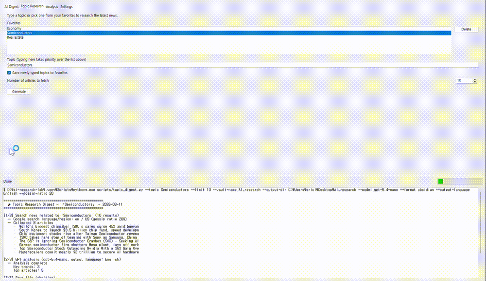
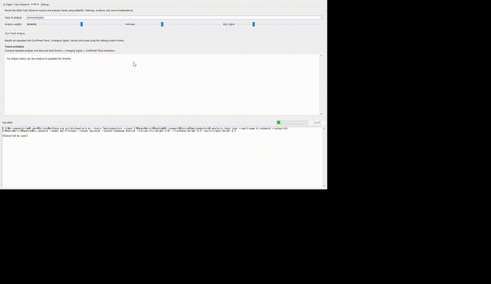

# AI Research Lab

> **AI-powered research that turns scattered information into credible trends and emerging signals.**

AI Research Lab is an AI-powered research platform designed to collect information from multiple sources, evaluate its credibility and freshness, and transform scattered information into structured insights.

It combines **topic research, source evaluation, trend analysis, emerging-signal detection, rumor-oriented research, and Obsidian integration** into a single research workflow.

---

## ✨ What Makes AI Research Lab Different?

Most research tools focus on finding information.

AI Research Lab focuses on **understanding how trustworthy, recent, and meaningful that information is**.

Instead of simply returning a collection of search results, the system attempts to distinguish between:

* **Confirmed Trends** — patterns supported by multiple credible sources
* **Emerging Signals** — early indications that may develop into a significant trend
* **Rumors** — weakly verified or opinion-driven information that may still be worth monitoring

This allows users to explore not only **what is being reported**, but also **how much confidence should be placed in it**.

---

## 🎬 Demo

### 🔎 Topic Research

Search a topic and collect relevant information from the web.



### 📊 Analysis

Analyze collected information using credibility, freshness, and trend signals.



---

## 🚀 Features

### 🔎 Topic Research

Search for information related to a topic and collect relevant sources into a structured research digest.

The research workflow can consider:

* Search language
* Search region
* Output language
* Research depth
* Gossip / rumor ratio
* AI model
* API Base

---

### 🌐 Multi-language Research

Research does not have to be limited to English.

The selected language can influence:

* Search language
* Search region
* Suggested topics
* Research output
* Analysis output

For example, an English research configuration can use English-language search results and produce English research output, while Korean configuration can perform Korean-oriented research.

---

### 🎯 Credibility & Freshness

Information is not treated equally.

AI Research Lab considers factors such as:

* Source credibility
* Information freshness
* Cross-source consistency
* Nature of the source
* Degree of verification

These signals can then influence the weight assigned to information during analysis.

---

### 📈 Trend Analysis

The Analysis system uses collected information to identify meaningful patterns and developments.

Research results can be organized into:

#### Confirmed Trend

A trend supported by relatively strong and consistent evidence.

#### Emerging Signal

A developing pattern that may become important but does not yet have sufficient evidence to be considered confirmed.

#### Rumor

Information with weak verification, strong speculation, or primarily opinion-based origins.

---

### 🗣️ Gossip & Rumor-Oriented Research

Research does not always need to focus exclusively on conventional news sources.

The **gossip ratio** can be adjusted to change the research strategy.

A higher gossip ratio encourages the system to explore more opinion-driven, personal, speculative, and less-formal sources rather than relying primarily on conventional news reporting.

This is useful when researching:

* Early rumors
* Industry speculation
* Public sentiment
* Personal commentary
* Unconfirmed developments
* Early signals before mainstream coverage

Rumor-oriented information is treated as a **signal to investigate**, not as confirmed fact.

---

### 🤖 Flexible AI Model Support

AI Research Lab supports GPT-family models by default while also allowing users to enter a model name manually.

The actual model availability depends on the configured **API Base**.

This means that if a compatible API provider exposes another model through the configured API endpoint, the user can potentially specify that model directly.

> **Note:** Compatibility depends on the API provider's API format and supported endpoints. AI Research Lab does not guarantee compatibility with every third-party model or provider.

---

### 🔌 Custom API Base

The AI endpoint is configurable rather than being permanently tied to a single provider.

Users can configure:

```text
API Key
API Base
Model
```

This makes the research workflow more flexible for compatible API providers and locally hosted or alternative model services.

---

### 📝 Obsidian Integration

Research results can be exported into an Obsidian vault.

This makes AI Research Lab suitable for building a long-term personal knowledge system rather than simply generating temporary answers.

Research results can be organized by topic and date, making it easier to:

* Accumulate research
* Review historical information
* Connect ideas
* Track developing trends
* Build a personal knowledge base

---

## 🧠 Research Workflow

The overall workflow can be understood as:

```text
Topic
  │
  ▼
Web Research
  │
  ▼
Source Collection
  │
  ▼
Credibility & Freshness Evaluation
  │
  ▼
AI Analysis
  │
  ├── Confirmed Trends
  ├── Emerging Signals
  └── Rumors
  │
  ▼
Structured Output
  │
  ▼
Obsidian / Research Vault
```

The goal is to move from:

> **"What information exists?"**

toward:

> **"What information matters, how reliable is it, and what might happen next?"**

---

## 🛠️ Installation

### Requirements

* Windows
* Python
* Git
* [uv](https://docs.astral.sh/uv/)
* A compatible AI API

Clone the repository:

```bash
git clone https://github.com/EricLKIM/AI-Research-Lab.git
cd AI-Research-Lab
```

Create the environment and install dependencies:

```bash
uv sync
```

Activate the environment if needed:

```powershell
.venv\Scripts\activate
```

---

## 🔑 Configuration

Create a `.env` file based on the provided example:

```text
.env.example
```

Configure your API credentials:

```env
OPENAI_API_KEY=your_api_key_here
OPENAI_API_BASE=https://api.openai.com/v1
```

> **Never commit your `.env` file or API keys to Git.**

The repository includes a `.gitignore` configuration that excludes local secrets and application-specific state.

---

## ▶️ Running AI Research Lab

The graphical application can be launched using:

```powershell
run_app.bat
```

Additional research workflows are available through the provided scripts:

```powershell
run_topic_digest.bat
run_digest.bat
```

For troubleshooting:

```powershell
diagnose_gui.bat
```

---

## 📁 Project Structure

```text
AI-Research-Lab/
│
├── assets/
│   ├── Analysis.gif
│   └── Topic_Search.gif
│
├── docs/
│   └── adr/
│
├── scripts/
│   ├── app.py
│   ├── analysis.py
│   ├── topic_digest.py
│   ├── research_digest.py
│   └── ...
│
├── src/
│   └── research_lab/
│       ├── analyzer/
│       ├── crawler/
│       ├── digest/
│       ├── export/
│       ├── knowledge/
│       ├── memory/
│       ├── obsidian/
│       └── utils/
│
├── .env.example
├── .gitignore
├── pyproject.toml
└── uv.lock
```

The project is intentionally structured to keep application entry points, reusable modules, research logic, and export functionality separated.

---

## 🧪 Research Philosophy

AI Research Lab is designed around three principles:

### 1. Information is not equally reliable

A search result should not automatically be treated as a fact.

### 2. Fresh information can be more valuable than established information

A developing signal may be important even when it has not yet become a widely confirmed trend.

### 3. Weak signals are useful when clearly labeled

Rumors and speculation should not be presented as facts.

However, they can still be valuable for identifying questions that deserve further investigation.

Therefore, AI Research Lab separates **confidence** from **potential significance** rather than treating them as the same thing.

---

## ⚠️ Limitations

AI-generated analysis is probabilistic and should not be treated as a definitive source of truth.

In particular:

* Credibility scores are analytical estimates.
* Emerging signals may turn out to be insignificant.
* Rumors may be false.
* Search results depend on external search engines and available sources.
* Model output depends on the selected AI model and API provider.
* Third-party API compatibility depends on the provider's implementation.

AI Research Lab is intended as a **research assistance and information-analysis tool**, not as a substitute for professional judgment or primary-source verification.

---

## 🗺️ Roadmap

Planned and potential future improvements include:

* [ ] Improved source credibility scoring
* [ ] More advanced cross-source verification
* [ ] Historical trend comparison
* [ ] Better emerging-signal detection
* [ ] Expanded source types for rumor-oriented research
* [ ] More AI provider compatibility
* [ ] Automated testing
* [ ] GitHub Actions CI
* [ ] Improved research visualization
* [ ] Community-driven feature development

The roadmap may evolve as the project develops.

---

## 🤝 Contributing

Contributions, ideas, bug reports, and feature requests are welcome.

If you find a problem or have an idea that could improve the research workflow, please open an Issue or Pull Request.

Before contributing, please review the project's contribution guidelines.

---

## 🔐 Security

Never publish API keys, passwords, personal credentials, or other secrets in Issues, Pull Requests, commits, or source files.

For security-related issues, please follow the project's security policy.

---

## 📄 License

License information will be added as the project reaches its first formal public release.

---

## ⭐ Support the Project

If AI Research Lab is useful to you, consider giving the repository a ⭐ Star.

It helps the project become more visible and makes it easier for other researchers and developers to discover it.

**GitHub:**
https://github.com/EricLKIM/AI-Research-Lab
